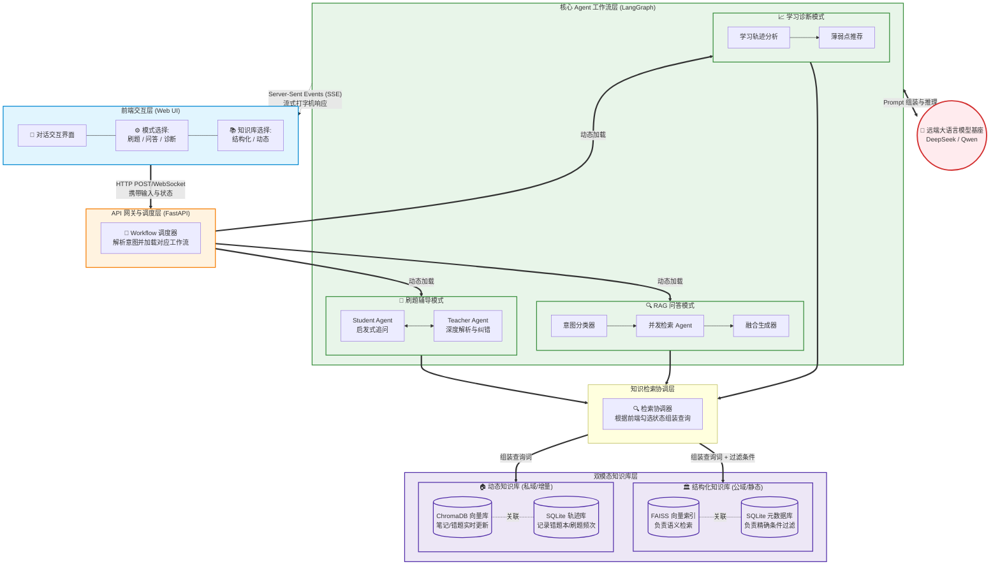

```mermaid
flowchart TD
    %% 前端层
    subgraph Frontend["前端交互层 (Web UI)"]
        direction LR
        UI[💬 对话交互界面]
        ModeSelect[⚙️ 模式选择: <br>刷题 / 问答 / 诊断]
        KBSelect[📚 知识库选择: <br>结构化 / 动态]
        UI --- ModeSelect --- KBSelect
    end

    %% 网关与路由层
    subgraph Gateway["API 网关与调度层 (FastAPI)"]
        Router[🚦 Workflow 调度器<br>解析意图并加载对应工作流]
    end

    %% 核心逻辑层
    subgraph Core["核心 Agent 工作流层 (LangGraph)"]
        direction TB
        
        subgraph Mode1["🎯 刷题辅导模式"]
            direction LR
            S_Agent[Student Agent<br>启发式追问] <--> T_Agent[Teacher Agent<br>深度解析与纠错]
        end
        
        subgraph Mode2["🔍 RAG 问答模式"]
            direction LR
            Classifier[意图分类器] --> RAG_Agents[并发检索 Agent] --> Gen[融合生成器]
        end
        
        subgraph Mode3["📈 学习诊断模式"]
            direction LR
            Analyzer[学习轨迹分析] --> Recommender[薄弱点推荐]
        end
    end

    %% 数据检索层
    subgraph Retrieval["知识检索协调层"]
        Coordinator[🔍 检索协调器<br>根据前端勾选状态组装查询]
    end

    %% 知识库层
    subgraph DataBase["双模态知识库层"]
        direction LR
        subgraph StaticKB["🏛️ 结构化知识库 (公域/静态)"]
            FAISS[(FAISS 向量索引<br>负责语义检索)]
            SQLite1[(SQLite 元数据库<br>负责精确条件过滤)]
            FAISS -.关联.- SQLite1
        end
        
        subgraph DynamicKB["🏠 动态知识库 (私域/增量)"]
            Chroma[(ChromaDB 向量库<br>笔记/错题实时更新)]
            SQLite2[(SQLite 轨迹库<br>记录错题本/刷题频次)]
            Chroma -.关联.- SQLite2
        end
    end

    %% 大模型基座
    LLM((🧠 远端大语言模型基座<br>DeepSeek / Qwen))

    %% 连线逻辑 (自上而下)
    Frontend ==>|HTTP POST/WebSocket<br>携带输入与状态| Gateway
    
    Gateway ==>|动态加载| Mode1
    Gateway ==>|动态加载| Mode2
    Gateway ==>|动态加载| Mode3

    Mode1 ==> Retrieval
    Mode2 ==> Retrieval
    Mode3 ==> Retrieval

    Retrieval ==>|组装查询词 + 过滤条件| StaticKB
    Retrieval ==>|组装查询词| DynamicKB
    
    %% 模型交互
    Core <==>|Prompt 组装与推理| LLM
    
    %% 返回链路 (修复了这里的语法糖解析错误)
    Core -. "Server-Sent Events (SSE)<br>流式打字机响应" .-> Frontend
    
    %% 样式美化
    classDef layer fill:#f9f9f9,stroke:#333,stroke-width:2px,rx:5px,ry:5px;
    classDef frontend fill:#e1f5fe,stroke:#0288d1,stroke-width:2px;
    classDef backend fill:#fff3e0,stroke:#f57c00,stroke-width:2px;
    classDef agent fill:#e8f5e9,stroke:#388e3c,stroke-width:2px;
    classDef db fill:#ede7f6,stroke:#512da8,stroke-width:2px;
    classDef llm fill:#ffebee,stroke:#d32f2f,stroke-width:3px;

    class Frontend frontend;
    class Gateway backend;
    class Core,Mode1,Mode2,Mode3 agent;
    class DataBase,StaticKB,DynamicKB,FAISS,SQLite1,Chroma,SQLite2 db;
    class LLM llm;
```